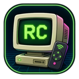
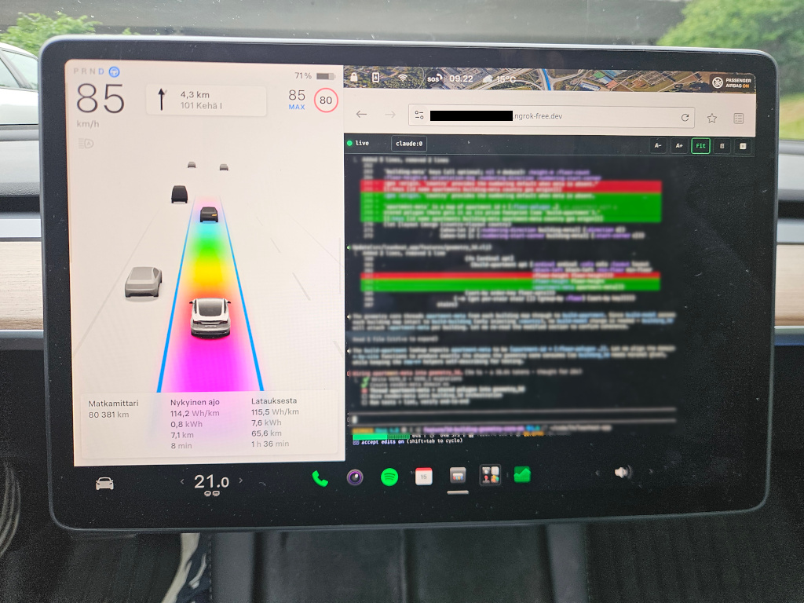
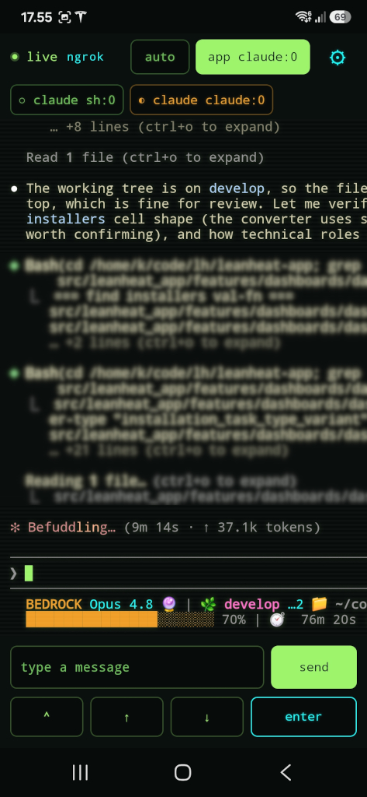

<p align="center">
  
</p>

<h1 align="center">Airc Tmux Remote</h1>

<p align="center">
  <em>Watch and steer your laptop's tmux session — and the AI coding agent running in it — from any phone, tablet, or car browser.</em>
</p>

<p align="center">
  <a href="#60-second-quick-start">Quick Start</a> ·
  <a href="#clients">Clients</a> ·
  <a href="#going-remote">Going Remote</a> ·
  <a href="INSTALLATION.md">Install</a> ·
  <a href="#more-docs">Docs</a>
</p>

---

You start an AI coding agent — Claude Code, Codex, Copilot, whatever — in a tmux
session and walk away. Airc lets you glance at what it's doing from the couch,
and tap a few keys to nudge it along, without unlocking the laptop.

It's a small Node server on your laptop that captures tmux panes, serves a live
browser viewer, and accepts input only from clients holding a token. It's not
tied to any one AI tool — if it runs in tmux, you can watch and drive it.

**The browser is all you need.** A phone, tablet, or even a car browser opens
the viewer over your LAN with zero accounts and zero install. The
[Android app](#android-app-optional) and [public tunnel](#going-remote) are
optional add-ons for when you want more.

<p align="center">
  
</p>

## 60-Second Quick Start

You need **Node ≥ 20** and **tmux**. Nothing else.

```sh
git clone https://github.com/Kynde/airc.git
cd airc
npm install

tmux new -s main            # or attach to a session you already have

tools/airc local --session main   # serve on your LAN
tools/airc pair-web               # prints a QR + URL — open it on your phone
```

Scan the QR (or open the printed URL) on any device on the same Wi-Fi, and the
live terminal is in your hand. That's it.

> **No tokens to configure.** On first run Airc generates strong `viewToken` and
> `controlToken` values into `config.json` for you. `pair-web` hands out the
> view-only token; [`pair-web-control`](#view-vs-control) hands out the one that
> can type.

`local` mode binds your LAN address and keeps everything on your own network —
no third-party services involved.

## Clients

Airc is a server with two interchangeable front-ends. **You only need the browser.**

| Client | Setup | View | Control |
|---|---|---|---|
| **Browser** — phone, tablet, desktop, Tesla | none | ✓ | ✓ (with control token) |
| **Android app** *(optional)* | build the APK once | ✓ | ✓ |

The Android app is a nicer always-on experience — native keyboard, attention
alerts, automatic LAN↔public failover — but everything it does over the network
the browser does too. Pick whichever fits; you can ignore the app entirely.

### View vs. Control

Airc uses two tokens, so you can share a read-only link safely:

- **`viewToken`** — can *watch* the terminal, nothing else.
- **`controlToken`** — can watch **and** send keystrokes to tmux.

```sh
tools/airc pair-web           # QR/URL with the VIEW token (read-only)
tools/airc pair-web-control   # QR/URL with the CONTROL token (can type)
tools/airc pair-app           # Android pairing payload (control token)
```

The browser only shows the input controls when you open it with a control token.

## Features

- **Live tmux mirror** — ANSI colors and cursor position, updated over WebSocket
  with HTTP-polling fallback.
- **Follow the active pane** automatically, or pin a specific pane.
- **Type from anywhere** — text input plus quick Up / Down / Enter / Esc / Tab /
  Ctrl-key buttons that target the viewed pane.
- **Attention alerts** — Airc notices which pane's agent is waiting on *you* and
  can auto-follow it. See [Attention](docs/attention.md).
- **Readable on small screens** — font fit/manual sizing, light/dark theme,
  pause.
- **Works in a car** — tested in a Tesla browser; the viewer stays live while
  driving. See [Tesla notes](docs/tesla-browser.md).

## Going Remote

`local` mode only reaches devices on the same Wi-Fi. To watch from anywhere —
mobile data, a friend's network, a car on the road — Airc can run behind a
public [ngrok](https://ngrok.com) tunnel:

```sh
tools/airc on --session main   # start the server with the configured tunnel
tools/airc pair-web            # QR/URL now points at the public address
```

ngrok needs a (free) account and a one-time setup, and you set your own tunnel
domain in `config.json`. The full walkthrough — plus how to serve LAN **and**
tunnel at once so the app uses a direct connection at home and the tunnel away —
is in **[INSTALLATION.md](INSTALLATION.md#public-access-with-ngrok)**.

## Android App (optional)

A native client with a few comforts the browser can't easily match:

- tmux pane display with ANSI colors and cursor
- follow-active-pane by default, plus a pane picker for pinning
- Android keyboard input including dictation from the system IME
- quick keys and app-side font adjustment (`A-` / `A+`)
- attention chips + an `auto` toggle that follows whichever pane needs you
  (see [Attention](docs/attention.md))
- one pairing payload carries both LAN and public URLs, and the app fails over
  between them automatically

Grab the signed APK from the [latest release](https://github.com/Kynde/airc/releases/latest)
(`airc-<version>.apk`) and sideload it, or build it yourself with the Android
SDK. See **[INSTALLATION.md](INSTALLATION.md#installing-the-android-app)**.

<p align="center">
  
</p>

## Common Commands

```sh
tools/airc local --session NAME   # serve on the LAN (no tunnel, no accounts)
tools/airc on --session NAME      # serve behind the configured ngrok tunnel
tools/airc status                 # process + health
tools/airc pair-web               # view-only browser QR/URL
tools/airc pair-web-control       # control browser QR/URL
tools/airc pair-app               # Android pairing QR/JSON
tools/airc off                    # stop the server
tools/airc logs                   # path to the server log
```

There's also a zsh completion at `completions/_airc` (subcommands, `status
--json`, and live tmux session names for `--session`); wiring is covered in
[INSTALLATION.md](INSTALLATION.md#zsh-completions).

## More Docs

- [Installation](INSTALLATION.md): full prerequisites, ngrok setup, building the app
- [Docs index](docs/README.md): recommended reading order
- [Operations](docs/operations.md): running, pairing, sizing, troubleshooting
- [Development](docs/development.md): architecture, APIs, build/test notes
- [Implementation Notes](docs/implementation-notes.md): tmux capture, auth, polling, sizing
- [Attention](docs/attention.md): detecting which pane's agent needs you
- [Tesla Browser Findings](docs/tesla-browser.md): in-car browser/network notes
- [Future Work](docs/future-work.md): known next improvements

## Project Layout

- `tools/airc`: start/stop/status/pair wrapper for the laptop server
- `src/server.js`: HTTP/WebSocket API and lifecycle
- `src/tmux.js`: tmux capture, pane listing, and input forwarding
- `public/`: browser viewer and terminal assets
- `android-app/`: optional native Android client
- `config.example.json`: server config defaults

## License

[MIT](LICENSE).
